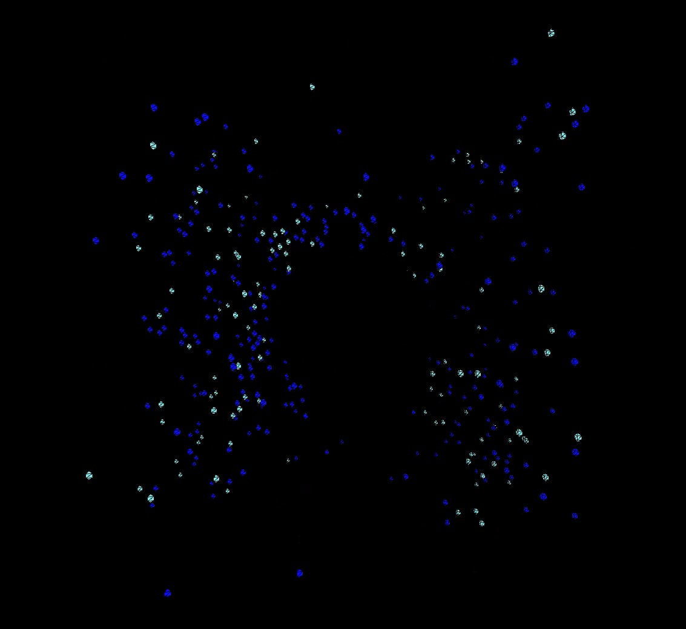
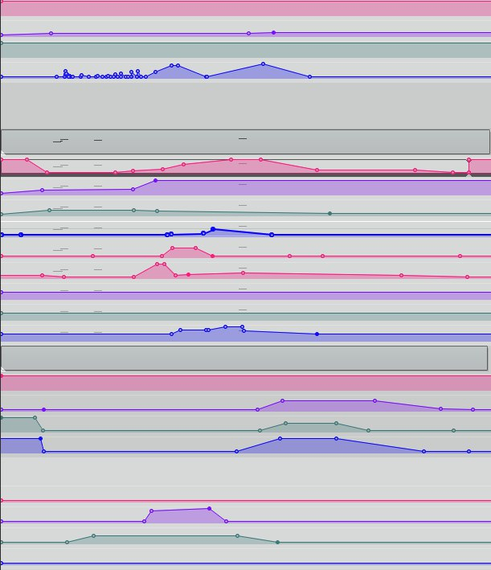

# Introduction

Music generation is often times a process in which two or more entities interact and draw inspirations from the sounds created by other performers to inform their own behaviour. In the interaction between machine and performer, the machine can be seen as one such entity. 

Sound synthesisers are commonly understood as musical instruments, but with sound generating devices gaining complexity through technological advancement, they can also gain autonomy in their function as performing entities in the music generation process.

In musical improvisation this process happens while the music is being generated. However in experimental composition techniques, established through the work of composers of *Musique Concrète*, a composition is being informed by the material which is used to create it. The feedback to user input of music generation systems can act as such a material and can inform decisions about the composition in a workflow that could be understood as trial-and-error.

The nature of musical generation through interaction and feedback manifest themselves not only in the workflow with Lavina, but also in the interactions between the individual particles of the flocking system.

# Background

## Particle System

Particle systems are collections of large numbers of particles, each having its own behaviour. In models of flocking, there are three accelerating forces acting upon any given particle. [@craig_reynolds_flocks_1987]

1. Collision Avoidance: avoid collisions with nearby flockmates.
2. Velocity Matching: attempt to match velocity with nearby flockmates.
3. Flock Centering: attempt to stay close to nearby flockmates.

In the particle system Lavina uses, the finite sized birds are replaced by point objects and the velocity matching is omitted. Collision Avoidance is realised by giving the particles a charge. Similiar to charged particles in physics, there is a negative attractive force at close distances which allows the particles to avoid each other and objects in the environment. Flock Centering works via an attractive force to all other particles in the the perception radius of each particle, which scales with distance similar to gravity. [@t_m_blackwell_swarm_2002]

To allow for more chaotic behaviour and expand artistic expression the option to add random acceleration to the particles was added. A greater sense of space is achieved by the addition of the wind parameter, which allows to apply a directed acceleration to all particles.

## Experimental Composition

In the tradition of European classical music the creative process starts in the imagination of the composer. The idea is committed to notation and then performed by performers to reach its final auditory form. In the early days of electronic music in Germany, notably in the cologne studios for electronic music, this tradition of idea, notation and performance in this order was preserved. In France however, a new form of composition was being developed. The composers of *Musique Concrète* used recorded sound materials as their starting point, and tried to derive the musical essence of these materials by manipulating them, while being guided by their musical tastes and intuitions. [@brindle_new_1987 S. 108]

Working with partially autonomous sound generating systems can be seen as an extension of this French tradition. The Composer might start with an idea in mind, but the hard to predict audio engine, gives a reaction, that then requires the composer to react accordingly and find a way to adapt their composition based on their intuition and vision.

# Design

## Sonification

The sonification is based on sound objects which are choosen by the composer. They can be loaded into the software and are played back by each particle. Each particle has randomised adjustable sample offset, pitch randomisation and randomised filter curves to achieve differentiation between particles. The particles experience a simulated doppler-effect, meaning a velocity dependent pitch variation, as well as distance simulation via filter and gain adjustments that are dependant on the distance from the listening sweet spot to the particle.

The sound parameters and flocking behaviour variables can be real time adjusted, via MIDI CC input. This enables the composer to create automation curves which serve as the notation for their composition. This information is then fed to the software to create the sonification and visuals.

## Animation

For the visualisation the space in which the particles move is rendered in real time. The particles are represented by spheres, moving through a cubical room while the middle of this room represents the listening position. The spheres are coloured based on MIDI CC input by the composer. Thereby the composer can choose colours based on their understanding of the musical material with which the software is fed.

# Composition

An example composition was created to help in developing and testing the tools, as well as to demonstrate them. Reaper was used to create MIDI CC output that controls the input variables of the software. The timeline consists of envelopes which are turned into MIDI CC messages via the ReaMidiControl plugin. The audio performance is then recorded via *Soundflower* and the visualisation is recorded via a screen recorder in the Java Processing environment.

## Sound Material

The sound material for the composition was created by taking pieces of popular music that were transformed through granular synthesis with the Max/MSP project *DroneBox* [@ohland_jonasohlanddronebox-max_2019]

The pieces that were chosen for granular synthesis editing were:

1. *Guillotine* by *Death Grips*
2. *Daydreaming* by *Radiohead*
3. *Nathalie Neil* by Swans
4. *Ocean Song* by *Daughters*

The pieces were chosen based on their sonic characteristics of complexity of texture, musical consonance/dissonance and their timbre.

These pieces were used because popular music in particular has become an inescapable part of the artificial sonic environment. In this way it shapes the relationship audiences have to devices with sound generating capabilities. One of the objectives of Lavina is the exploration of musical human-machine interfaces on the side of the composer. Therefore a connection to the human-machine interface in the perception of the audience seemed fitting.

## Timeline

The composition starts out with particles all across the room that are suddenly appearing and disappearing in a flashing manner. The particle amount increases while they are staying for longer and are moving through space faster. The cohesion of the particles increases and they start to form tighter flocks, which start to move toward the listener. Cohesion is then decreased and the randomisation of movement is increased while the sound they create is becoming less dissonant until they are finally evenly dispursed throughout the virtual room. The particles then proceed to slow their movement and to align to ever tighter flocks, while the audio is faded out to silence. 

# Conclusion

Lavina provides composers with tools to navigate 3D audio compositions in a way, that doesn't directly involve them manipulating sound sources, resulting in an intuitive workflow with spatial compositions. The possibilities given by the option to use envelopes to control every aspect of the swarms behaviour and sound are sufficient for individual expression, while retaining the nature of swarm behaviour at the core of every composition created with Lavina.

At this stage, the software is using a manageable amount of computing resources but therefore cannot correctly simulate all important aspects of audio spatialisation. This makes differentiation between particles difficult, especially in binaural listening environments.

As all processing in Lavina happens in real time, applications which involve real time performance aspects could be explored, thus creating the possibility for improvisational approaches to spatial audio.

# References

